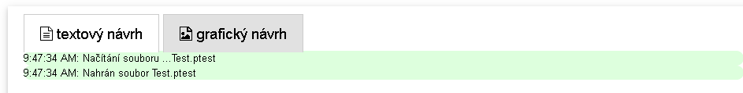

# Grafický návrh

V rádmci editačního módu lze pro návrh obrazovek použít grafické prostředí (grafický návrh).  Tento způsob editace doplňuje práci se slovními přikazy v příkazové řádce . Před užitím grafického návrhu je tak v příkazové řádce třeba založit obrazovky a vložit stimuli. Posléze je možné otevřít grafický editor poklepáním na záložku 'Grafický návrh' na liště nad editačním oknem

<figure><figcaption>
Snímek obrazovky lišty nad editačním oknem
</figcaption></figure>

Grafický editor užívá grafické rozhraní knihovny GrapeJs. Pracovní postup při práci s grafickým editorem se skládá s jednotlivých a po sobě jdoucích kroků a je takto proto také představen v následucjícíh odstavcích.&#x20;
