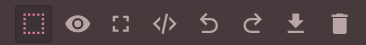

# Návrh velikosti obrazovky

První krok zahrnuje volbu velikosti testové obrazovky z nabídky v levém horním rohu editoru. Menší obrazovku je výhodnější zvolit pokud bude test primárně určen pro mobilní telefony. Prostřednictvím této volby lze také ověřit chování testu na obrazovkách různé velikosti.

<figure><figcaption></figcaption></figure>

V pravé části obrazovky jsou na stejné liště také další ovládací prvky. Jimi je možné provedené akce vrátit zpět či vrácení odvolat. Lze také provést import či vyčistit celý formulář (delete). Grafický náhled lze přepnout do režimu plné obrazovky (full screen) a lze zobrazit i jeho kód (view code).

<figure><figcaption></figcaption></figure>
