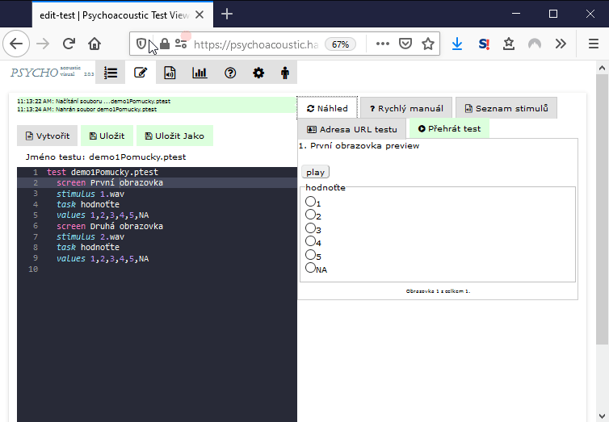

# Přehrát test

Test lze přehrát v režimu ladění, kdy není kontrolováno vyplnění úkolu pomocí tlačítka 'Přehrát test'.

 (1).png>)

Vyvolá se nové okno prohlížeče v kterém lze rychle přejíždět další obrazovky a zkontrolovat vizualizaci tak, jak se opravdu zobrazí účastníkovi testu. Nové okno po zkontrolování lze zavřít.


Pozor! URL adresa testu obsahuje značku `performtest/mode/debug,`která způsobí, že při procházení obrazovek není vyžadováno vyplnění odpovědí. Lze tak rychle projít všechny obrazovky. Pro distribuci testu ke konečnému uživateli použijte link ze záložky "Adresa testu".


