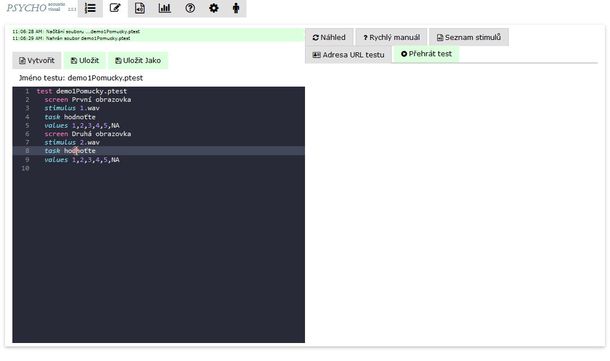

# Seznam stimulů

Stisknutí tlačítka 'Seznam stimulů'

.png>)

se zobrazí seznam dostupných stimulů, které lze přiřadit do testovací obrazovky. Kliknutím na stimul se vytvoří na kurzoru editoru nový řádek s klíčovým slovem stimulus a konkrétním souborem.

