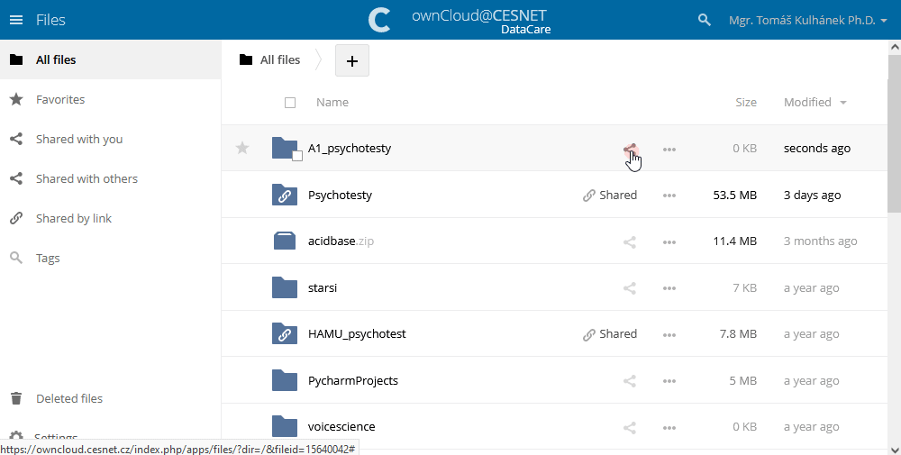
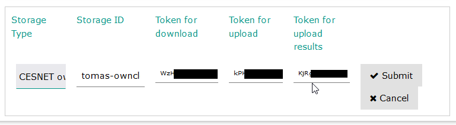
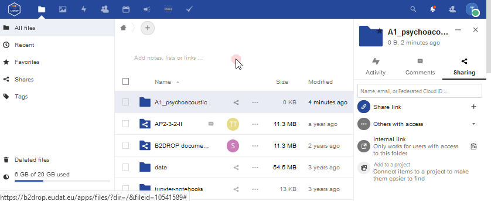
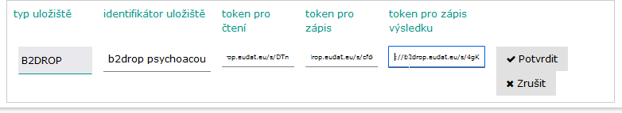

# Připojení datového uložiště

Sdílené složky na datových úložištích slouží administrátorovi (programátorovi) percepčního testu pro:

A) čtení stimulových souborů (zvukových záznamů. obrázků a videí)  - složka musí mít povoleno čtení dat

B) čtení a zápis ptest souborů s definicí testu- složka musí mít povoleno čtení i zápis dat;

C) zápis výsledků testů - musí být povolen zápis dat (např. slepý zápis, file upload only)

Přístup do datového uložiště pomocí A) a C) se zakóduje v URL testu, je možné mít takto nasdílené různé složky. Přístup do datového uložiště pomocí B) - je pouze pro potřeby editoru.

Jsou podporovány tato datová uložiště:

* CESNET owncloud&#x20;
* B2DROP (nextcloud)
* pCloud (omezená podpora)

## CESNET owncloud

CESNET nabízí uživatelům (studentům a zaměstnancům univerzit a dalším členům CESNET) datové úložiště owncloud [https://owncloud.cesnet.cz/index.php/login](https://owncloud.cesnet.cz/index.php/login) s kapacitou až 100 GB.

1. Pokud uživatel ještě není registrován, pak je potřeba se registrovat jako uživatel na adrese [https://owncloud.cesnet.cz/index.php/login](https://owncloud.cesnet.cz/index.php/login) autentikace pomocí účtu univerzity.
2. Vytvořit nový adresář/složku, případně zvolit existující adresář.
3. Vytvořit 2 linky pro sdílení, první s právem na čtení, druhý s právem na čtení a zápis
4. Vytvořit adresář nebo zvolit existující adresář pro výsledky (je možno zvolit stejný adresář jako v kroku 2
5. Vytvořit link pro sdílení s právem slepého zápisu (file upload only)

<figure><figcaption>
CESNET owncloud vytvoření sdílených linků
</figcaption></figure>

Linky vytvořené v kroku 3 a 5 zkopírovat do nastavení psychotest editoru

<figure><figcaption>
CESNET uložiště v PAVE
</figcaption></figure>

## B2DROP

služba evropské infrastruktury nabízející základ 20GB a prémiovým uživatelům (na požádání organizace nebo komunity 100-500 GB).&#x20;

1. Pokud uživatel ještě není registrován, pak je potřeba se registrovat jako uživatel na adrese [https://b2drop.eudat.eu/](https://b2drop.eudat.eu/) autentikace pomocí účtu univerzity v evropě (včetně českých).&#x20;
2. Vytvořit adresář, nebo vybrat existující adresář s testy a stimuly
3. Vytvořit 2 linky, pro čtení (read only), pro čtení/zápis (allow upload and editing)
4. Vytvořit nebo vybrat adresář pro zápis výsledků - je možné zvolit stejný adresář jako v kroku 2 a 3 nebo jiný prázdný adresář
5. vytvořit 1 sdílený link s právem slepého zápisu (file-drop/upload only) viz poslední část video návodu.

<figure><figcaption>
B2DROP vytvoření sdílených linků
</figcaption></figure>

V nastavení psychotest editoru, zvolit poskytovatele B2DROP a zkopírovat linky vytvoření v kroku 3 a 5 zkopírovat do patřičných polí:

<figure><figcaption>
B2DROP uložiště v PAVE
</figcaption></figure>

## pCloud

Veřejná služba, nabízející 10 GB zdarma, další prostor placený buď měsíčně, ročně, nebo jednorázově tzv. Lifetime.

1. Pokud nemá uživatel účet, tak registrace na[ https://www.pcloud.com](https://www.pcloud.com)
2. V adresáři Public vytvořit nový, např. Psychotesty
3. Kliknout na “Get public link”
4. Tento link zkopírovat do UI psychotestu jen pro čtení

Protože chybí link pro zápis a slepý zápis, lze pcloud použít pouze pro čtení existujících testů a stimulů a vytvoření unikátního linku pro přístup k percepčnímu testu.
