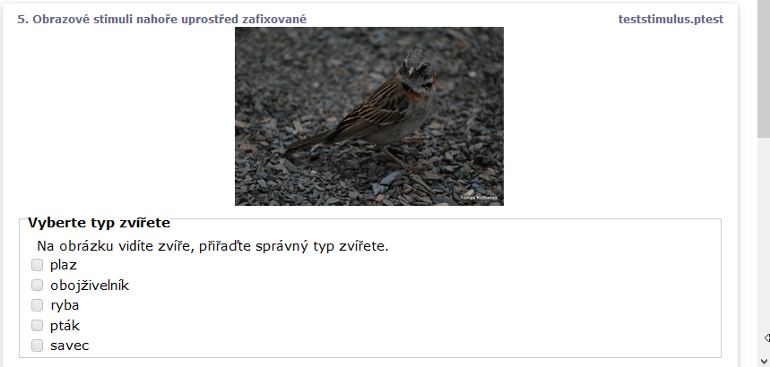

# Obrázek a jeho prezentace vlevo, vpravo, nahoře

`stimulus` po kterém následuje 1 nebo více souborů s příponou`png` nebo `jpg` se zobrazí jako obrázek na stránce testu.


```
test demo2obrázky
  screen Čtvrtá obrazovka
  stimulus IMG_4604.JPG
  task Vyberte typ zvířete
  text Na obrázku vidíte zvíře, přiřaďte správný typ zvířete.
  values plaz, obojživelník, ryba, pták, savec
```

 (1).png>)

Stimuli se zobrazí vlevo a úkoly (tasky) se zobrazí postupně vpravo a dolu.

### Obrázek vpravo

Pro změnu zobrazení obrázku vpravo je možno využít CSS styl a vložit ho jako text do obrazovky: `text <style>.stimulus{float:right}</style>`

```

screen Obrazové stimuly vpravo
  stimulus IMG_4604.JPG
  text <style>.stimulus{float:right}</style>
  task Vyberte typ zvířete
  text Na obrázku vidíte zvíře, přiřaďte správný typ zvířete.
  values plaz, obojživelník, ryba, pták, savec
```

.png>)

### Obrázek uprostřed

Pro zobrazení obrázku nahoře uprostřed je možné opět využít následující CSS styl a vložit ho jako _text_  do obrazovky: `text <style>.stimulus{width:100%} .stimulus img{margin-left:auto;margin-right:auto;display:block}</style>`

```
screen Obrazové stimuly vpravo
  stimulus IMG_4604.JPG
  text <style>.stimulus{width:100%} .stimulus img{margin-left:auto;margin-right:auto;display:block}</style>
  task Vyberte typ zvířete
  text Na obrázku vidíte zvíře, přiřaďte správný typ zvířete.
  values plaz, obojživelník, ryba, pták, savec
```

.png>)

### Obrázek uprostřed nahoře a zafixován při rolovaní okna

Pro zobrazení obrázku nahoře uprostřed a navíc zafixování viditelnosti při rolování je možné opět využít následující CSS styl a vložit ho jako _text_  do obrazovky: `text <style>.stimulus{width:100%;position:sticky;top:0;z-index:1} .stimulus img{margin-left:auto;margin-right:auto;display:block}</style>`

```
screen Obrazové stimuli nahoře uprostřed zafixované
  stimulus IMG_4604.JPG
  text <style>.stimulus{width:100%;position:sticky;top:0;z-index:1} .stimulus img{margin-left:auto;margin-right:auto;display:block}</style>
  task Vyberte typ zvířete
  text Na obrázku vidíte zvíře, přiřaďte správný typ zvířete.
  values plaz, obojživelník, ryba, pták, savec
  task Vyberte typ pozadí
  text Na obrázku vidíte zvíře, a pozadí, přiřaďte správný typ pozadí.
  values písek, tráva, štěrk, kamení, beton
  task Vyberte typ zvířete 3
  text Na obrázku vidíte zvíře, přiřaďte správný typ zvířete.
  values plaz, obojživelník, ryba, pták, savec
  task Vyberte typ zvířete 4
  text Na obrázku vidíte zvíře, přiřaďte správný typ zvířete.
  values plaz, obojživelník, ryba, pták, savec
```



