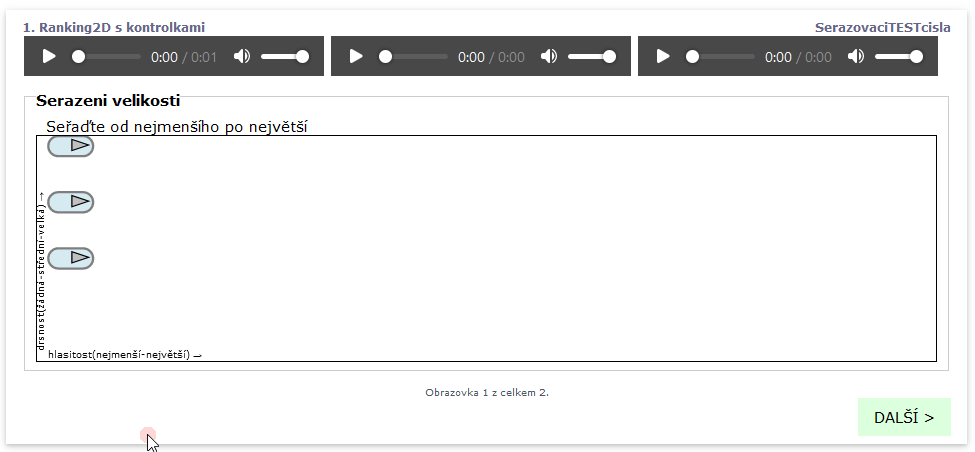

# Seřazovací úkol (ranking2d)

`ranking2d` vytvoří seřazovací (třídící) úkol, který nabízí 2 dimenzionální pole, do kterého lze umístit stimuli a setřídit je dle až 2 různých veličin.

### Seřazovací (ranking2d) s kontrolkami stimulů

Příklad:

```
screen Ranking2D s kontrolkami
    stimulus(controls) 1.wav
    stimulus(controls) 2.wav
    stimulus(controls) 5.wav     
  	task Serazeni velikosti
      text Seřaďte od nejmenšího po největší
  	   ranking2d hlasitost(nejmenší-největší);drsnost(žádná-střední-velká)

```

Se zobrazí jako následující obrazovka s kontrolkami pro možnost zastevení přehrávání nebo pro možnost přehrát jen část zvuku.



### Anotace (poznámky) ke stimulům v ranking2d

Jednotlivé stimuli lze opatřit anotací (poznámkou), která se ve výsledcích objeví jako volitelné pole. Poznámky jsou přiřazeny ke zvukům, viz následující náhled obrazovky.


### Seřazovací (ranking2d) se skrytými tlačítky stimulů

V některých případech je zádoucí prvky (tlačítka, kontrolky) stimulů skrýt a nechat viditelný jen sežazovací pole. Toho se dá dosáhnout např. pomocí  `css .stimulus{display:none}`

```
screen Ranking2D bez tlacitek
    stimulus 1.wav
    stimulus 2.wav
    stimulus 5.wav     
    stimulus 7.wav     
    #css .stimulus{display:none}
  	task Serazeni velikosti
      text Seřaďte od nejmenšího po největší
  	   ranking2d hlasitost(nejmenší-největší);drsnost(žádná-střední-velká)  
```

.png>)


