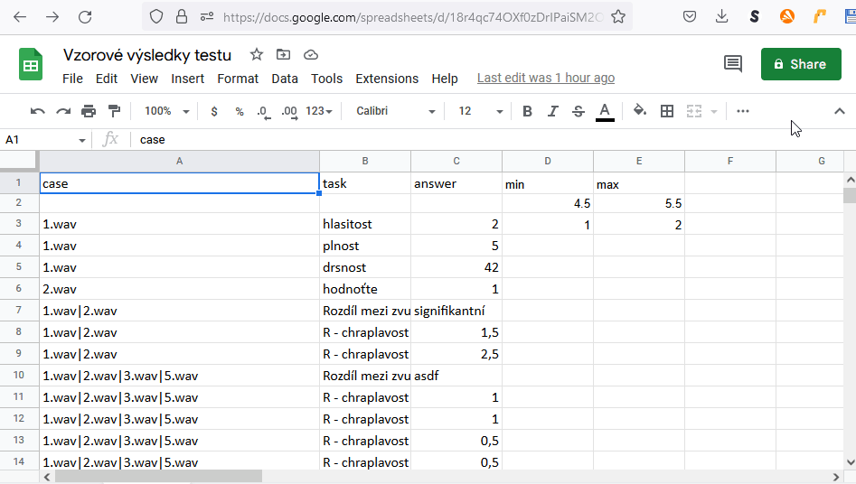

# Edukační mód

V definici testu lze zvolit tzv. edukační mód, který na začátku nahraje vzorové hodnoty pro úkoly (tasky) a pak je uživateli zobrazí v průběhu testu. Těsně za prvním řádkem definice testu musí následovat:

`type educational [soubor se vzorem vysledku]`

Poté následuje běžná definice obrazovek např:

```
test demo9.edu.ptest
type educational demo9.edu.ptest..2022-06-23T07-49-45.432Z.presult
  screen First Screen Description
  stimulus 1.wav
  task G - celková porucha
	scale 0 3(0.5) 0 <u>norma</u> 0.5 <i>minim.</i> 1 mírná  2 <b>střední</b> 3 <b><u>"velmi těžká"</b></u>
  task R - chraplavost / drsnost    
 		scale 0 3(0.5) 0 <u>norma</u> 0.5 <i>minim.</i> 1 mírná  2 <b>střední</b> 3 <b><u>"velmi těžká"</b></u>
  task diagnóza
  values "mírná porucha se střední drsností","norma","střední celková porucha s mírnou drsností","střední celková porucha s těžkou drsností"
```

Při vykonávání testu se při stisknutí tlačítka Next nebo Finish zobrazí v tzv. edukačním módu vzorové výsledky, na škále se objeví v zelené barvě, ve výčtu se zobrazí zvýrazněné zelenou barvou, viz obrázek.


## Soubor se vzorem výsledku .presult

Jakýkoliv vyplněný test a jeho data ve formátu .presult se mohou stát vzorem pro edukační mód.

Pokud je .presult umístěn ve stejném datovém uložišti jako definice testu, lze zadat přímo jméno souboru

```
test demo1PomuckyEduPresult.ptest
   type educational demo1Pomucky.ptest.hlasitost-3.2022-06-23T06-22-36.565Z.presult
   ...
```

## Soubor se vzorem výsledku .CSV

Vyplněný test lze konvertovat do formátu CSV nebo XLSX a upravit v aplikaci (MS Excel, ...) poté uložit jako CSV soubor. Česká mutace Excelu ukládá CSV s necelými čísly jako čísla s čárkou. Dále je nutné zvolit kódování češtiny UTF-8, takový soubor uložit do stejného datového uložiště vedle definice testu. Pak lze zadat opět jméno soubor CSV:

```
test demo1PomuckyEduCsv.ptest
  type educational demo1edu2.csv
  ...
```

## Soubor se vzorem výsledku ve sdíleném dokument Google Sheets

Výsledek testu lze nahrát do sdíleného dokumentu Google Sheets. Ten musí mít následující formát:

1. první řádek obsahuje názvy sloupců `case task answer` a volitelne `min max`
2. následující řádky obsahují položky testu a vzorovou odpověď ve sloupci answer
3. List musí být pojmenovaný `Sheet1`
4. Prováděcí test pak najde opdovídající dvojice case a task a zobrazí vzorovou odpověď

<figure><figcaption></figcaption></figure>

Dokument google sheet, je potřeba sdílet pomocí linku který se vytvoří tlačítkem Share/Sdílet

<figure><figcaption></figcaption></figure>

Tento link pak lze zadat jako zdroj pro edukační mód, viz níže&#x20;

```
test demo1PomuckyEduGSheet.ptest
    randomstimuli 
  type educational https://docs.google.com/spreadsheets/d/xxxxxxxxxxxxxxxxxxxxxxxxxxxxxxxx/edit?usp=sharing
```

## Edukační mód pro Ranking2D

Ve výsledku je nutné definovat odpověď v poli answer v tomto formátu

```
audio[1]160,16|audio[2]255,55|audio[3]381,98
```

Např. jak je vidět v tabulce sdíleného Google Sheetu

<figure><figcaption></figcaption></figure>

Při vyplňování testu se zobrazí edukativní (vzorové hodnoty) v ranking 2D jinak podbarveny

<figure><figcaption></figcaption></figure>
