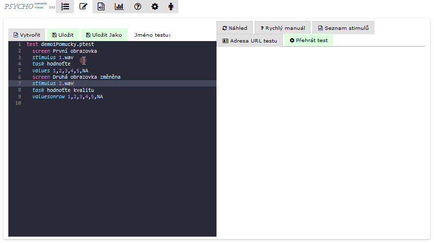

# Quick manual

Accessible using the 'Quick manual' button:

The button will display a brief manual on how to write the tests and the syntax of the different keywords for defining the test screen. A detailed description will be displayed when hovering over the screen.

<figure><figcaption></figcaption></figure>
