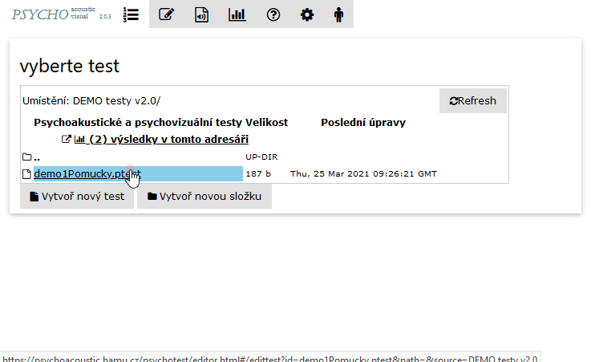

# Screen preview

Press the 'preview' button for generating a quick preview of the screen.'

This will generate a rough preview of the screen at the location of the cursor in the editor. Changes of the test structure or test can be repeatedly inspected this way

<figure><figcaption></figcaption></figure>
