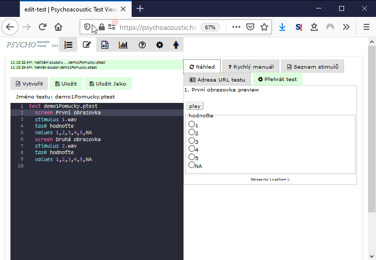

# Test playback

The test can be run and overviewed in an inspection mode. This mode does not necessitate the use of a 'playback' button.

It will open a new browser window and its screens can be viewed as they would appear in the test for inspection of their visuals. The test window can be closed after the inspection at request.


Caution! The URL address of the test contains a code 'performtest/mode/debug'. The code causes the screens to not necessitate answering any items so that they can be quickly overviewed. For actual test purposes, please use the link from the 'test address' screen.


<figure><figcaption></figcaption></figure>
