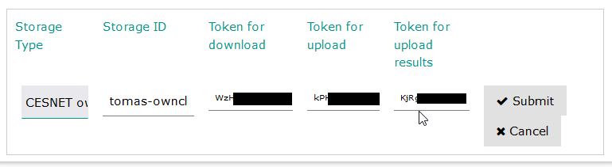

# Connecting a remote file storage

An administrator (programmer) of the perceptual test can use shared folders on data storage to :

A) read the stimuli files (sound waveforms, pictures or videos). Data read needs to be set for the folder.

B) write and read the ptest files containing the test definitions. Data read and write needs to be set for the folder.

C) write the results of the test. Data write permissions need to be set for the folder (eg. as blind write for file upload only).

The test URL allows A and C access to the data storage. Multiple folders can be simultaneously shared this way. The B access to the data is only required for the editor.

The following data storages are supported:

* CESNET owncloud
* B2DROP (nextcloud)
* pCloud (limited support)

## CESNET owncloud

CESNET assigns users, students and employees of universities and its other members, an owncloud data store with a 100Gb capacity [https://owncloud.cesnet.cz/index.php/login](https://owncloud.cesnet.cz/index.php/login).

1. Unregistered users need to register by authenticiating using their university account as users on the below address. [https://owncloud.cesnet.cz/index.php/login](https://owncloud.cesnet.cz/index.php/login) .
2. Create new folder or select an existing folder.
3. Create 2 links for sharing, the first one with rights to read and the second one with the right to read.
4. Create a folder or select an existing folder for the results (the same folder as in step number two can be selected)
5. Create a share link with blind write rights (file upload only).

<figure><figcaption>
Creating a shared link on Cesnet owncloud
</figcaption></figure>

Assign the previously created links in steps 3 and 5, in the editor settings.

<figure><figcaption>
Cesnet PAVE store
</figcaption></figure>

## B2DROP

A service of the european infrastructure. A 20GB account is offered as baseline and a further 100-500GB account is offered as premium upon request of the organisation or community.

1. Unregistered users need to register as users on this adress: [https://b2drop.eudat.eu/](https://b2drop.eudat.eu/). Authenticiation can be performed using university account .
2. Create a folder or select an existing folder with tests and stimuli
3. Create two links for reading (read only) and reading and writing (to allow upload and editing)
4. Create and select the folder for writing the results (it is possible to select the same folder as in the second and third step or any other empty folder).
5. Create 1 shared link with the right of blind write (file-drop/upload only) see the last part of the video tutorial.

<figure><figcaption>
 
</figcaption></figure>

Select the provider (B2DROPú in the psychotest editor setting and copy the links 3 and 5 into the corresponding fileds:

<figure><figcaption>
 
</figcaption></figure>

## pCloud

Public service offering 10GB free account (additional space is purchase only with either monthly, yearly or single lifetime subscriptions).

1. Unregistered users should register at [https://www.pcloud.com](https://www.pcloud.com)
2. Create a new folder in the public folder (eg. psychotests)
3. Click on “Get public link”
4. The link can be only copied as read only link into the user interface of the editor.

Due to the missing write and blind write link, pcloud can only be used to read existing tests and stimuli or to create a uniqe link for the access to a psychotest.
