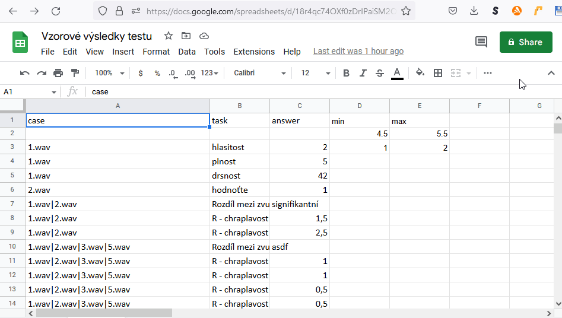

# Educational mode

An educational mode can be specified in the test. The mode loads pre-defined values in tusk upon the playback of the test to the users. The mode can be accessed by inserting the following code below the defining line:

`type educational [the results file to be loaded]`

Further screens can be defined as usual, e.g:

```
test demo9.edu.ptest
type educational demo9.edu.ptest..2022-06-23T07-49-45.432Z.presult
  screen First Screen Description
  stimulus 1.wav
  task G - celková porucha
	scale 0 3(0.5) 0 <u>norma</u> 0.5 <i>minim.</i> 1 mírná  2 <b>střední</b> 3 <b><u>"velmi těžká"</b></u>
  task R - chraplavost / drsnost    
 	scale 0 3(0.5) 0 <u>norma</u> 0.5 <i>minim.</i> 1 mírná  2 <b>střední</b> 3 <b><u>"velmi těžká"</b></u>
  task diagnóza
  values "low impairment","normal","medium impairment","high impairment"
```

Pressing the next or finish button in this mode will display the loaded results. They will appear in highlighted in green on the scale in list (as in the picture).

<figure><figcaption><p> </p></figcaption></figure>

## The .presult file with results

Data from completed tests or any other data in the .presult format can be used as source for the educational mode.

It is just enough to enter the filename if the .presult file is placed in the same data storage as the test file.

```
test demo1PomuckyEduPresult.ptest
   type educational demo1Pomucky.ptest.hlasitost-3.2022-06-23T06-22-36.565Z.presult
   ...
```

## A .CSV file with the results

A completed test can be converted into a CSV or XLSX format for later editing in an editor (MS Excel, ...). The resulting file can then be loaded as CSV. Some national Excel versions will save the numbers in the CSV file in an incomplete form: a comma separator and UTF-8 coding must be selected and the file has to be saved in the data storage alongside the original. The file can be loaded just by stating its filename:

```
test demo1PomuckyEduCsv.ptest
  type educational demo1edu2.csv
  ...
```

## The file with a template of the results in a shared Google Sheet document.

The results can be uploaded as a shared Google Sheets document. The following format is, however, necessary:

1. the first line contains the names of the columns `case task answer` and the optional `min max`
2. following lines will contain a template response in the answer field 3. The list needs to be named as `Sheet1`
3. The test will then link the cases in each corresponding task and will display the template answer

<figure><figcaption><p> </p></figcaption></figure>

The Google Sheet document should be shared using a link created by the Share button.

<figure><figcaption><p> </p></figcaption></figure>

This link can be entered as source in the educational mode, see below

```
test demo1PomuckyEduGSheet.ptest
    randomstimuli 
    type educational https://docs.google.com/spreadsheets/d/edit?usp=sharing
```

## Educational mode for Ranking2D

The answers for the answer field have to be coded in following formát

```
audio[1]160,16|audio[2]255,55|audio[3]381,98
```

E.g. as can be seen in a table of the shared Google sheet:

<figure><figcaption></figcaption></figure>

Educational (predefined) values will appear in a different colour during the course of the test.
