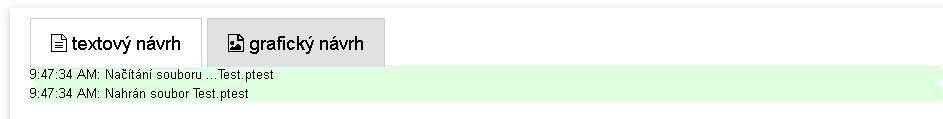

# Graphical design

The edit mode includes a graphical interface for the design of screens (graphical design). It complements the commands in the command line. A screen structure has to be set in the command line editor prior to entering the graphical editor and stimuli have to be inserted on each screen. After having inserted the screens structure, the graphical editor can be opened by clicking on the 'Graphical layout' tab above the command edit window.&#x20;

<figure><figcaption>
A screenshot of the graphical design tab
</figcaption></figure>

The graphical editor uses a graphical interface of the GrapeJs library. The workflow for working with the graphical editor is composed of individual consecutive steps overviwed in the followng paragraphs.&#x20;
