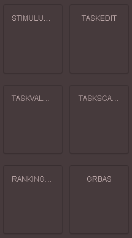

# Placing the response elements

A furhter step of the workflow includes placement of the response elements. These are the  `taskvalue` response fields, `taskscale`categorical evaluation of defined numerical or verbal values and the `ranking2d`verbal scales, and the `stimulus` equivalent of `ranking2d`, which allows constant stimuli.

<figure><figcaption></figcaption></figure>
