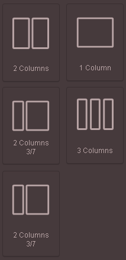

# Setting the grid

A further step of the workflow includes selecting the components in the graphical overview of the components using the following button. Clicking on the the blocs creates a grid wich can be enriched in response elements. The rows can be split into  1, 2, 3 collums and can be also split into two colums in the 3 / 7 ratio.&#x20;

<figure><figcaption></figcaption></figure>
