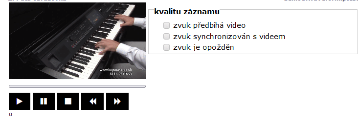

# Video

The `stimulus` command followed by one or more of the 'mp4' kind of stimuli will be shown as video with control elements on the test page.

```
test demo3videos
  screen Fifth screen
  stimulus clavinovapianoharmonica.mp4
  task quality of the recording
  values "the sound precedes the video", "the sound is synchronised with the video", "the sound is delayed"
```

<figure><figcaption><p> </p></figcaption></figure>
