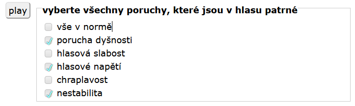

# Checkbox fields (checkboxvalues)

The checkbox fields can be used for selecting individual values.

### Vertical panel of checkboxes

the command `checkboxvalues` followed by a list of options separated by spaces (actual spaces in the values have to be bracketed '"') will display the fields in a vertical panel :

```
screen selection from several options
  stimulus 1.wav
  task select all impairments in a voice
  checkboxvalues "normal" "breathiness" "weakness" "strain" "hoarsness" "instability"
```

<figure><figcaption><p> </p></figcaption></figure>

### Adjacent horizontal checkboxes

The code `checkboxvaluesonrow` will display the values adjacent to each other on a single horizontal row.

```
screen selection from several options
stimulus 1.wav
task select all impairments in a voice
checkboxvalues "normal" "breathiness" "weakness" "strain" "hoarsness" "instability"
```

<figure><figcaption><p> </p></figcaption></figure>
