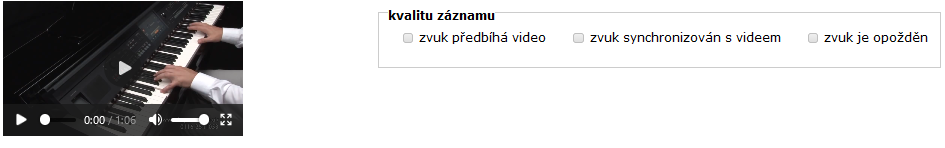

# Options and radio buttons (values)

Selecting exclusive options from a list can be done using radio buttons. These will present different statements or values for selection by the user.

### The ordered values

The list of `values` separated by a space will cause the values to appear below each other (actual and intentional spaces have to be places in commas '"'):

```
  screen Video
  stimulus pianoharmonica.mp4
  task the quality of the recording
  values "the sound precedes the video", "the sound is synchronised with the video", "sound is delayed"
```

<figure><figcaption><p> </p></figcaption></figure>

### Values beside each other

`valuesonrow` with a list separated by commas followed by a space will display the values beside each other (actual intentional spaces need to be put into commas '"' in the lists):

```
screen Video 2
stimulus stimuli/yamaha/clavinovapianoharmonica.mp4
task the quality of the recording
values "the sound precedes the video", "the sound is synchronised with the video", "sound is delayed
```

<figure><figcaption><p> </p></figcaption></figure>
