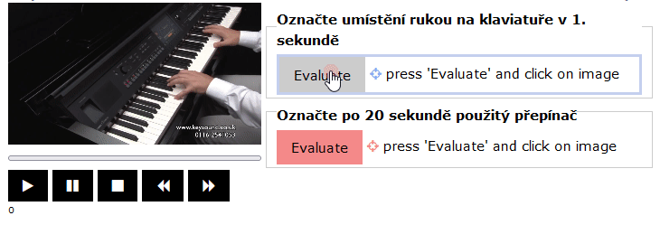

# Points in a video (videopoint, videomultipoint)

The following two tasks can also be used if the stimulus is a 'mp4' video:

* `videomultipoint` will show a distinct coloured button that will allow to select multiple points in the picture when activated. Clicking the right button will remove the last point.
* `videopoint` will show a distinct coloured button that will allow to select a point in the picture when activated. Clicking the right button will remove the point.

```
screen Selecting a point in the video
  stimulus stimuli/yamaha/clavinovapianoharmonica.mp4
  task Point the placement of hands on the keyboard during the 1st second.
  videomultipoint
  task Point to the switch used at the 20th second
  videopoint
```

<figure><figcaption></figcaption></figure>
