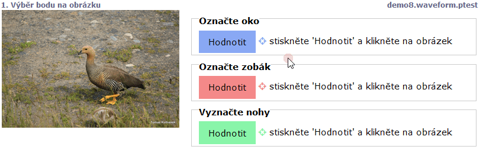

# Points in the picture (imagepoint, imagemultipoint)

If the stimuli is depicted as a picture, it can be used in these kinds of tasks:

* `imagemultipoint` will display a distinctly coloured button. More points can be selected on its press. The right button will remove the last point.
* `imagepoint` will display a differentiated coloured button. It can be pressed to select a point in the picture. The right button will remove the point.

```
screen The selection of a point in the picture
  stimulus stimuli/tomas/IMG_4687.JPG
  task Mark the eye
  imagepoint
  task Mark the pecan
  imagepoint
  task Mark the legs
  imagemultipoint
```

<figure><figcaption></figcaption></figure>
