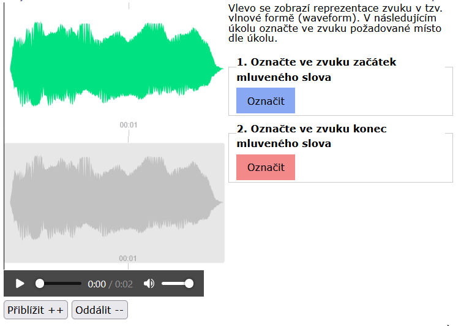
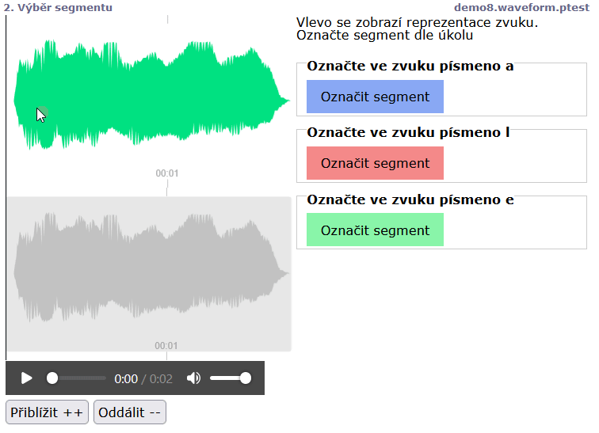

# The points and segments in the waveform of a sound signal (waveformpoint, waveformsegment)

The `waveformpoint` a `waveformsegment` commands can be used to present a graphical depiction of the stimuli waveforms and to o create a segment of the waveform appear as coloured button. Pressing it will add a point or segment to an actual time moment and this allows to additionally move it with a mouse.

```
screen Point selection
  stimulus(waveform) Preview.mp3
  text <style>.sounds{max-width:50%;width:50%}</style>
  text Will display a waveform of the sound in the left part of the screen. As part of the task, please mark a specific point in the waveform.
  task 1. Mark the beginning of a spoken word in the waveform
  waveformpoint
  task 2. Mark the end of the spoken word in the waveform
  waveformpoint
```

<figure><figcaption><p> </p></figcaption></figure>

```
screen Selection of the segment
stimulus(waveform) Preview.mp3
text <style>.sounds{max-width:50%;width:50%}</style>
text Will display a waveform of the sound in the left part of the screen. As part of the task, please mark a specific segment in the waveform.
task 1. Mark the word a
waveformsegment
task 2. Mark the word l
waveformsegment
task 3. Mark the word e
waveformsegment
```

<figure><figcaption><p> </p></figcaption></figure>
