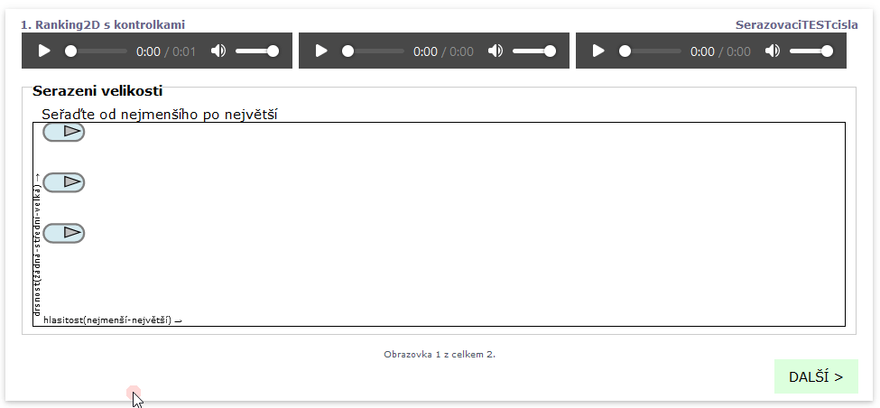
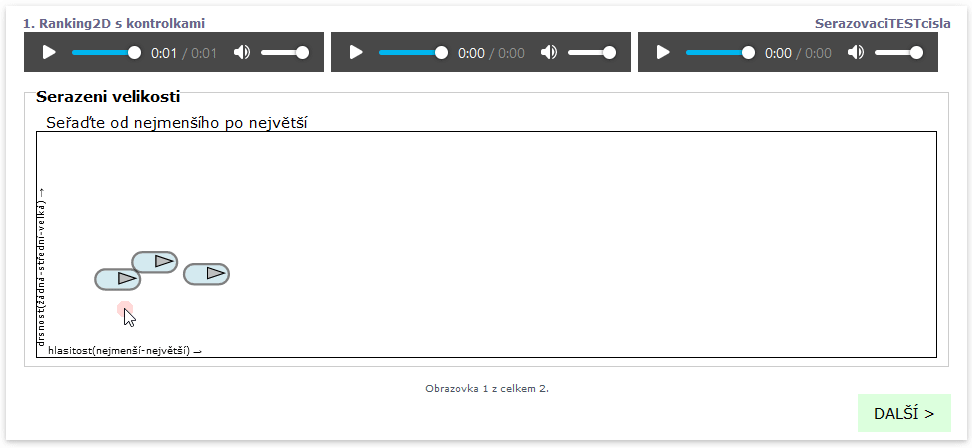

# The ranking task (ranking2d)

`ranking2d` will create a ranking task and offer a two dimensional field which can be populated with stimuli. The field can be used to sort the stimuli according to two different variables.

Syntax: `ranking2d popis_osy_x;popis_osy_y;rozestup_na_ose_y_v_px`

`popis_osy_x` is the description displayed on the X axis

`popis_osy_y` is the description displayed on the Y axis

`rozestup_na_ose_y_v_px` (optional, default 50) is the value, in pixels, of the spread of the cells with stimuli on the Y axis.

### The ranking test with the controls of the stimuli (ranking2d)

Example:

```
screen Ranking2D s with controls
    stimulus(controls) 1.wav
    stimulus(controls) 2.wav
    stimulus(controls) 5.wav     
  	task Ranking by size
      text Rank from the lowest to the highest
  	   ranking2d loudness(lowest-highest);roughness(null-medium-large)

```

It will be displayed as the following screen with the controls for stopping the playback or playing a part of the sound only. The cells with stimuli are ordered below each other with a 50px elementary spread.

<figure><figcaption><p>Clicking the play icon will play the stimuli (left button). Pressing and holding it will allow to drag the button to a different position.</p></figcaption></figure>

### Ranking of stimuli (ranking2d) with a variable height

Example:

```
screen Ranking2D with controls
    stimulus 1.wav
    stimulus 2.wav
    stimulus 5.wav     
    text <br/><br/>
  	task Ranking by size
      text Order from the lowest to the highest
  	   ranking2d loudness(lowest-highest);roughness(null-medium-large);20

```

Will appear as the following screen with controls allowing tho stop the playback or allow for a playback of a part of the sound only. The `text <br/><br/>` row will tabulate the ranking2D task below the buttons of the stimuli. The cells of the stimuli in the ranking2D are ordered below each other with 20px spacing.

<figure><figcaption><p> </p></figcaption></figure>

### Annotation of the stimuli in the ranking2d task

Individual stimuli in the ranking 2D task can be amended with an annotation or note. The note will appear as an additional answer field in the results. The notes are associated to sound (see the successive preview of the screen).

<figure><figcaption><p>Right clicking over the play button will initiate a dialog for annotating the sound</p></figcaption></figure>

### Ranking (ranking2d) with hidden buttons of the stimuli

It might be necessary to hide the some elements (buttons, controls) in the actual test and leave only the field visible. This can be achieved using the `css .stimulus{display:none}` command

```
screen Ranking2D without buttons
    stimulus 1.wav
    stimulus 2.wav
    stimulus 5.wav     
    stimulus 7.wav     
    #css .stimulus{display:none}
  	task Ordering by size
      text Order from the lowest to the greatest
  	   ranking2d loudness(lowest-highest);roughness(null-medium-large)  
```
