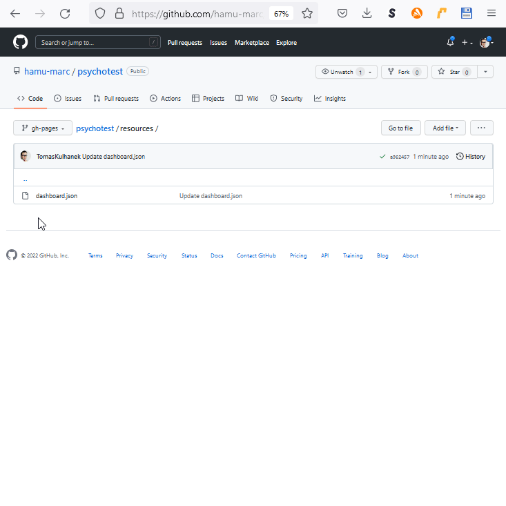

# A list of public tests

This routine allows to modify the list of public tests accessible to anyone on the [https://psychoacoustic.hamu.cz/psychotest/](https://psychoacoustic.hamu.cz/psychotest/) address.

1. A list of the tests is defined in the `dashboard.json` file
2. The file is placed in a repository at [https://github.com/hamu-marc/psychotest/tree/gh-pages/resources](https://github.com/hamu-marc/psychotest/tree/gh-pages/resources)
3. The structure is in the JSON format as an item field

```
[
  {
    "_id": "...generated suffix of URL beginning with N4gIg ...",
    "name": "... name to be displayed with bold font...",
    "description": "... description with normal font, HTML is allowed "
  },
  { ... }
 ]   
```

The initial screen will update within several minutes of 'Commiting' the edits of this file into the github repository.

<figure><figcaption><p> </p></figcaption></figure>
