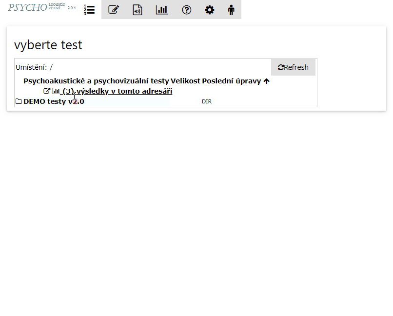

# The test list and its sorting by date

The screen with a list of linked data storages and a test list in them.

The tests can be ordered according the a date of their last edit by clinking on the 'recently edited' header. The arrow indicates whether it is sorted by an increasing or decreasing order.

<figure><figcaption></figcaption></figure>
