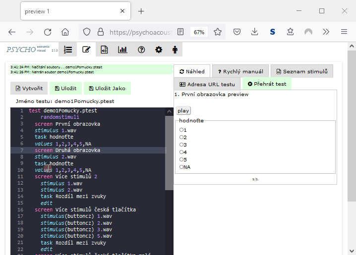
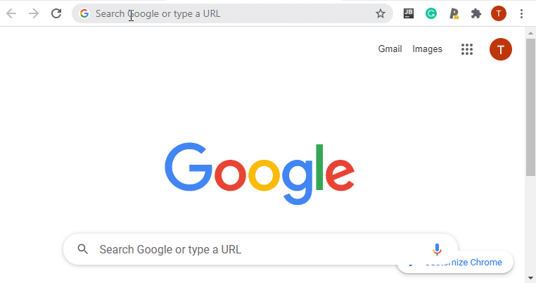

# Adresa testu

Stisknutím tlačítka Adresa URL testu:

 (1).png>)

se vygeneruje unikátní adresa (tzv. URL) testu, ve které je zakódováno umístění testu a stimulů. &#x20;

1. První URL pustí v prohlížeči nejprve úvodní obrazovku a poté pustí test podle definované struktury.&#x20;
2. Druhé URL pustí rovnou test dle definované struktury

Vybrané URL lze zkopírovat do schánky (tlačítko Copy to clipboard) a poslat např. e-mailem účastníkům, případně lze vyzkoušet v novém okně prohlížeče.&#x20;


Adresa URL přehraje test podle definované struktury v naposledy uložené verzi souboru. Nezapomeňte uložit editovanou verzi pomocí tlačítka 'Ulož'.


### Zkrácení adresy testu

Adresa testu v sobě obsahuje zakódované umístění testu, umístění výsledků a umístění stimulů, které se v průběhu testu načítají. Tato adresa je tudíž dlouhá, lze využít obecné zkracovače URL např.

* Služba BITLY na adrese [https://bitly.com](https://bitly.com) zkracuje dlouhá URL, i bez registrace lze vytvořit zkrácené URL ve formě https://bit.ly/....&#x20;

