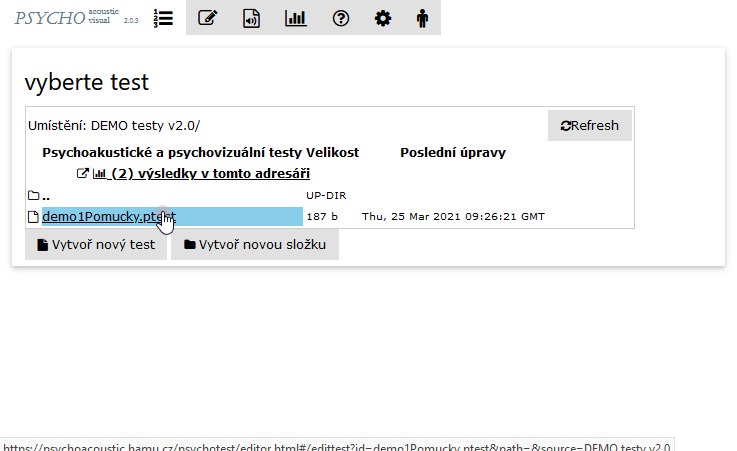

# Náhled obrazovky

Pro vygenerování rychlého náhledu obrazovky testu stiskněte tlačítko 'Náhled' 

V pravé části se vygeneruje hrubý náhled obrazovky, na kterém se vyskytuje kurzor v editoru. Po změně textu či struktury textu je opět možné v náhledu vidět změnu.

