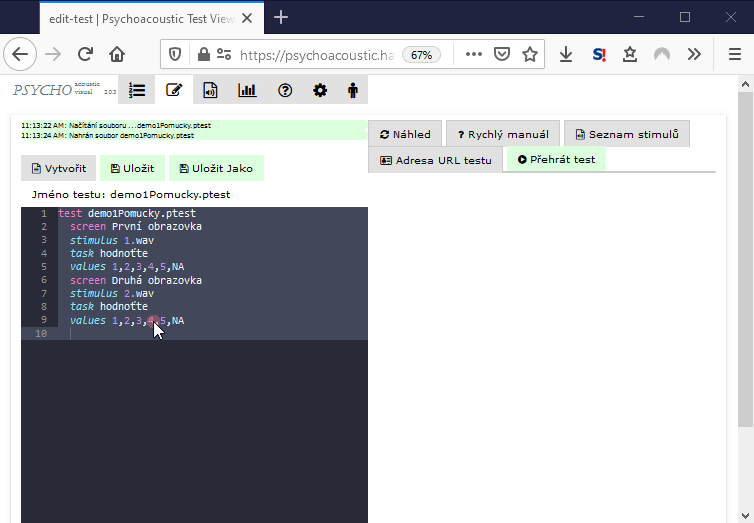

# Adresa testu

Stisknutím tlačítka Adresa URL testu:

se vygeneruje unikátní adresa testu, ve které je zakódováno umístění testu a stimulů a také kam se mají nahrát výsledky. URL lze zkopírovat do schánky a poslat např. e-mailem účastníkům, případně lze vyzkoušet v novém okně prohlížeče.

