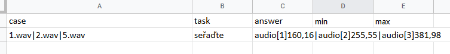

# Rychlý manuál

Při stisknutí tlačítka 'Rychlý manuál':

se zobrazí stručný rychlý manuál jak psát testy a syntax jednotlivých klíčových slov pro definici testové obrazovky. Při najetí na klíčové slovo se zobrazí detailnější popis.

