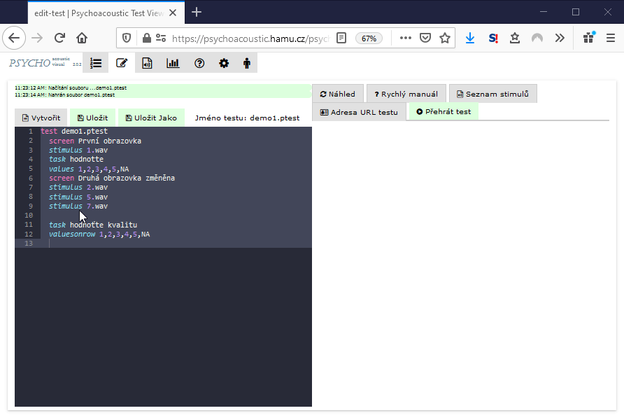

# Přehrát test

Test lze přehrát v režimu ladění, kdy není kontrolováno vyplnění úkolu pomocí tlačítka 'Přehrát test'.

Vyvolá se nové okno prohlížeče v kterém lze rychle přejíždět další obrazovky a zkontrolovat vizualizaci tak, jak se opravdu zobrazí účastníkovi testu. Nové okno po zkontrolování lze zavřít.

