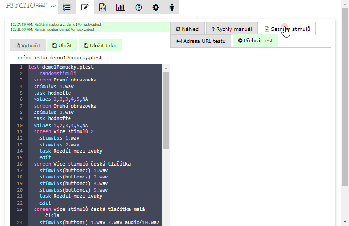

# Seznam stimulů v adresáři

Pokud jsou stimuli v podadresáři, v 'Seznam Stimulů' klikněte na adresář a zobrazí se stimuli v něm umístěné. Po kliknutí na stimul se přidá do testu včetně relativní cesty k němu.

