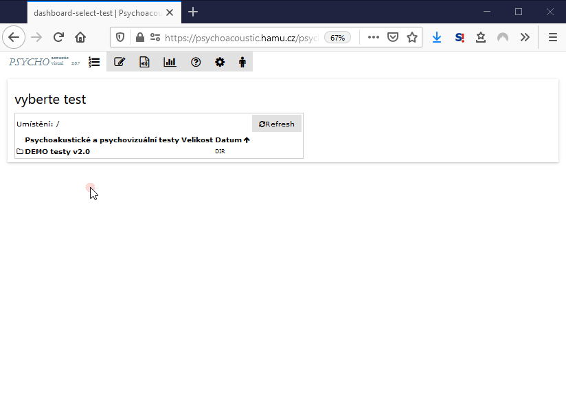

# Výsledky testů

Souhrnné výsledky testů jsou dostupné pokud se zvolí úložiště, počet uložených výsledků je k dispozici pod titulkem adresáře. Při kliknutí na konkrétní výsledek, se zobrazí náhled vpravo, je možné vybrat a sloučit více výsledků do jednoho souboru a to buď ve formátu XLSX \(Excel 2017+\) nebo ODS \(Open Document Spreadsheet\) nebo CSV \(Comma Separated Value\).

