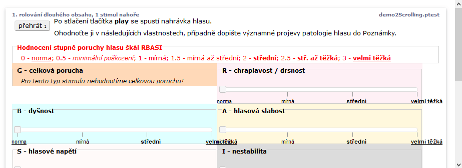

# Stimuli vždy na obrazovce

V obrazovce, kde se nachází více úkolů se může stát, že se vpravo zobrazí scrolovací sloupec a při skrolován dolů stimuli zmizí \(tlačítka zvuků, obrázek nebo video zmizí nahoře\). V tomto případě může být vhodné zafixovat pozici stimulů na obrazovce při skrolování. K tomu stačí kdekoliv na dotčené obrazovce přidat tento speciální text.

```text
text <style>.stimulus{position:sticky;top:0;z-index:1}</style>
```


tento text ve skutečnosti přidá CSS styl, který pro stimulus nastaví pozici 'sticky'. Při skrolování zůstane přilepená k horní hranici viditelné plochy obrazovky \(top:0\) a bude o něco výše, tj. zakrývat  ostatní prvky \(z-index:1\).


Příkladem je následující obrazovka s hodnocením více poruch hlasu:

```text
test demo2Scrolling.ptest
screen rolování dlouhého obsahu, 1 stimul nahoře 
  stimulus(buttoncz1) 1.wav
  text <style>.stimulus{position:sticky;top:0;z-index:1}</style>
  
  text Po stlačení tlačítka <b>play</b> se spustí nahrávka hlasu.
    text Ohodnoťte ji v následujících vlastnostech, případně dopište významné projevy patologie hlasu do Poznámky.
          
    task Hodnocení stupně poruchy hlasu škál RBASI
    #styleform float:left; width:100%; background-color:white; color:red
 		text 0 - <u>norma</u>;  0.5 - <i>minimální poškození</i>;  1 - mírná;  1.5 - mírná až střední;  2 - <b>střední</b>;  2.5 - <b>stř. až těžká</b>;  3 - <b><u>velmi těžká</b></u> 
    
    task G - celková porucha
    #styleform float:left; width:48%; background-color:peachpuff;
 		text <i>Pro tento typ stimulu nehodnotíme celkovou poruchu!</i>
    
    
    task R - chraplavost / drsnost
    #styleform float:left; width:48%; background-color:lavenderblush;
 		scale 0 3(0.5) 0 <u>norma</u> 0.5 <i>minim.</i> 1 mírná  2 <b>střední</b> 3 <b><u>"velmi těžká"</b></u>
    
    task B - dyšnost
    #styleform float:left; width:48%; background-color:lightcyan;
 		scale 0 3(0.5) 0 <u>norma</u> 0.5 <i>minim.</i> 1 mírná  2 <b>střední</b> 3 <b><u>"velmi těžká"</b></u>
    
    task A - hlasová slabost
    #styleform float:left; width:48%; background-color:cornsilk;
 		scale 0 3(0.5) 0 <u>norma</u> 0.5 <i>minim.</i> 1 mírná  2 <b>střední</b> 3 <b><u>"velmi těžká"</b></u>
    
    task S - hlasové napětí
    #styleform float:left; width:48%; background-color:snow;
 		scale 0 3(0.5) 0 <u>norma</u> 0.5 <i>minim.</i> 1 mírná  2 <b>střední</b> 3 <b><u>"velmi těžká"</b></u>
    
    task I - nestabilita
    #styleform float:left; width:48%; background-color:gainsboro;
 		scale 0 3(0.5) 0 <u>norma</u> 0.5 <i>minim.</i> 1 mírná  2 <b>střední</b> 3 <b><u>"velmi těžká"</b></u>
    
    task Hodnocení plnosti / znělosti hlasu
    #styleform float:left; width:100%; background-color:white; color:blue
 		text Vlastnost <b>plnost / znělost</b> reprezentuje bohatost a zdravost hlasu, <i>je opakem slabého, nebo ostrého hlasu.</i>
        
    task Plnost / znělost
    #styleform float:left; width:96%;background-color:honeydew;
 		scale 0 3(0.5) 0 "velmi slabá" 0.5 "velmi oslabená" 1 "středně oslabená" 1.5 "mírně oslabená" 2 "normálně znělý" 2.5 "zdravě zvučný" 3 "velmi zvučný"
  	
    task Poznámky
    #styleform float:left; width:100%;background-color:white;color:DarkOliveGreen
    text Popište případně jiné významné vlastnosti zvuku, zejména chrakterizujte <i>nestabilitu</i>
		edit?

```




