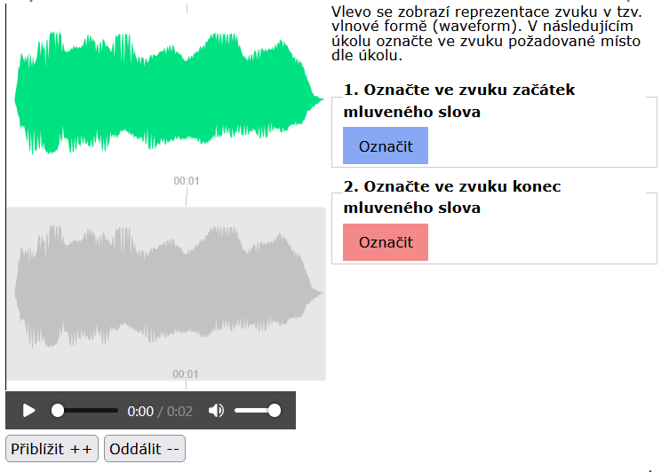
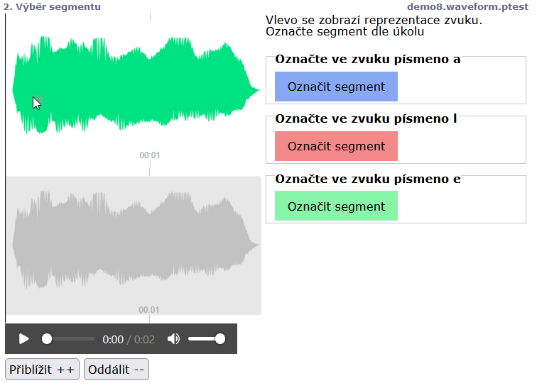

# Body a segmenty v průběhu signálu (waveform)

Pokud je stimulus zobrazen jako průběh grafického signálu, lze použít úkoly typu `waveformpoint` a `waveformsegment`

Úkol tohoto typu se zobrazí jako barevně odlišené tlačítko. Po jeho stisknutí se přidá bod nebo segment na aktuálně přehrávaný časový moment. Tímto bodem nebo segmentem lze poté ještě dodatečně hýbat myší.

```
screen Výběr bodu
  stimulus(waveform) ukazka1.mp3
  text <style>.sounds{max-width:50%;width:50%}</style>
  text Vlevo se zobrazí reprezentace zvuku v tzv. vlnové formě (waveform). V následujícím úkolu označte ve zvuku požadované místo dle úkolu. 
  task 1. Označte ve zvuku začátek mluveného slova
  waveformpoint
  task 2. Označte ve zvuku konec mluveného slova
  waveformpoint
```



```
screen Výběr segmentu
  stimulus(waveform) ukazka1.mp3
  text <style>.sounds{max-width:50%;width:50%}</style>
  text Vlevo se zobrazí reprezentace zvuku. Označte segment dle úkolu
  task Označte ve zvuku písmeno a
  waveformsegment
  task Označte ve zvuku písmeno l
  waveformsegment
  task Označte ve zvuku písmeno e
  waveformsegment
```


