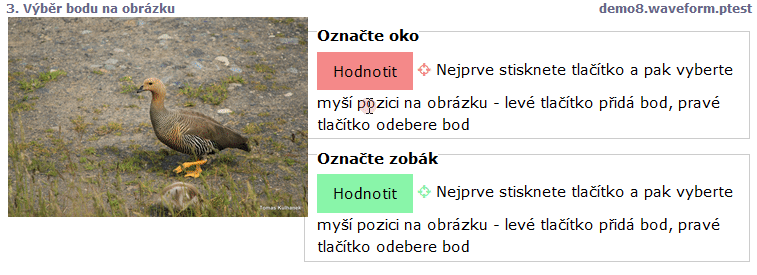

# Body na obrázku (image)

Pokud je stimulus zobrazen jako obrázek, lze použít úkol typu `image`, který zobrazí barevně odlišené tlačítko, po jeho stisknutí lze vybrat v obrázku bod nebo více bodů podle úkolu. Pravým tlačítkem se bod odebírá.

```
 screen Výběr bodu na obrázku
  stimulus stimuli/tomas/IMG_4687.JPG
  task Označte oko
  image
  task Označte zobák
  image
  
```


