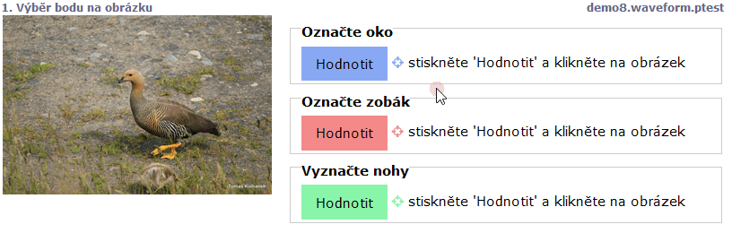

# Body na obrázku (imagepoint, imagemultipoint)

Pokud je stimulus zobrazen jako obrázek, lze použít tyto dva typy úkolů:

* `imagemultipoint` zobrazí barevně odlišené tlačítko, po jeho stisknutí lze vybrat v obrázku více bodů, pravým tlačítkem se poslední bod odebere.
* `imagepoint` zobrazí barevně odlišené tlačítko, po jeho stisknutí lze vybrat v obrázku bod. Pravým tlačítkem se bod odebírá.


```
screen Výběr bodu na obrázku
  stimulus stimuli/tomas/IMG_4687.JPG
  task Označte oko
  imagepoint
  task Označte zobák
  imagepoint
  task Vyznačte nohy
  imagemultipoint
```


