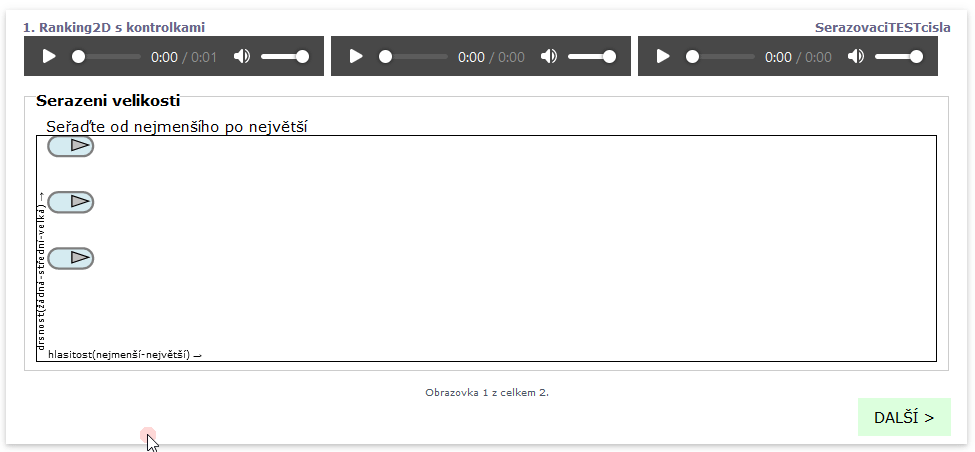
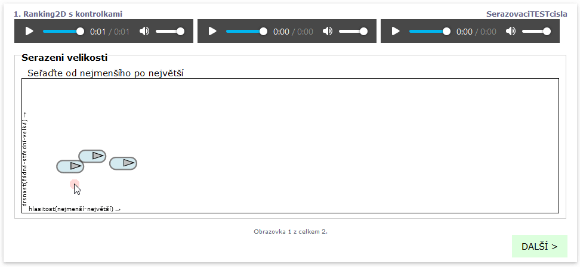

# Seřazovací \(třídící\) úkol

`ranking2d` vytvoří seřazovací \(třídící\) úkol, který nabízí 2 dimenzionální pole, do kterého lze umístit stimuli a setřídit je dle až 2 různých veličin.

Příklad:

```text
screen Ranking2D s kontrolkami
    stimulus(controls) 1.wav
    stimulus(controls) 2.wav
    stimulus(controls) 5.wav     
  	task Serazeni velikosti
      text Seřaďte od nejmenšího po největší
  	   ranking2d hlasitost(nejmenší-největší);drsnost(žádná-střední-velká)

```

Se zobrazí jako následující obrazovka s kontrolkami pro možnost zastevení přehrávání nebo pro možnost přehrát jen část zvuku.



Jednotlivé stimuli lze opatřit anotací \(poznámkou\), která se ve výsledcích objeví jako volitelné pole. Poznámky jsou přiřazeny ke zvukům, viz následující náhled obrazovky.




